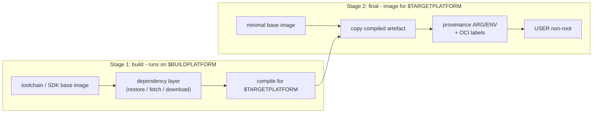
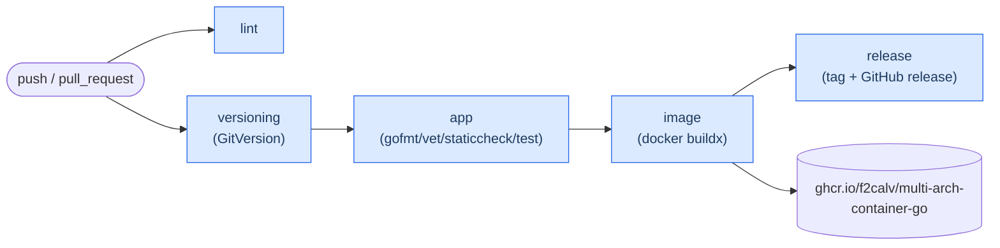

# Multi-Architecture Container Image w/Go

Building a **Go** application container image that targets `linux/amd64`, `linux/arm64` and `linux/arm/v7` - all from a **single** [Dockerfile](Dockerfile).

If you find this repository useful then give it a :star: ... :wink:

## Introduction

I've been developing a service orientated smart home system which consists of a number of containerised workloads running on an edge Kubernetes cluster (via [k3s](https://k3s.io/)), the "cluster" comprises two Raspberry Pi 4b (ARMv8).

As well as running multiple workloads on the Pi 4b I also run workloads on another Raspberry Pi 2b (ARMv7) which is much older (but very power efficient). And finally I also need to run general tests of the workloads on my local Windows development machine prior to deployment to my "Production cluster", and at a later date I may even want to run these workloads on [Azure Kubernetes Service](https://azure.microsoft.com/en-us/products/kubernetes-service/).

Although I could achieve my goal of deploying the same application to multiple architectures using separate Dockerfiles (i.e. Dockerfile.amd64, Dockerfile.arm64, etc...) in my view that is messy and makes the CI/CD more complex. I think the single Dockerfile is the elegant approach keeping all build instructions in one place.

## Sibling Repositories

The same trivial worker application is implemented four times, once per language. The repository layout, file names, CI workflow and even the Dockerfile comments are kept as close to identical as possible - so a developer fluent in one language can learn another language's containerisation story simply by diffing two repositories.

| Repository | Language | Build image | Final image | Cross-compilation mechanism |
| --- | --- | --- | --- | --- |
| [multi-arch-container-dotnet](https://github.com/f2calv/multi-arch-container-dotnet) | C# / .NET 10 | `mcr.microsoft.com/dotnet/sdk:10.0` | `mcr.microsoft.com/dotnet/runtime:10.0-noble-chiseled` | `dotnet publish -r <RID>` |
| [multi-arch-container-go](https://github.com/f2calv/multi-arch-container-go) | Go | `golang:1-bookworm` | `gcr.io/distroless/static-debian12:nonroot` | `GOOS` / `GOARCH` / `GOARM` |
| [multi-arch-container-rust](https://github.com/f2calv/multi-arch-container-rust) | Rust | `rust:1-bookworm` | `gcr.io/distroless/cc-debian12:nonroot` | `rustup target` + GNU cross linker |
| [multi-arch-container-python](https://github.com/f2calv/multi-arch-container-python) | Python 3.14 | `python:3.14-slim-bookworm` | `python:3.14-slim-bookworm` | Architecture-neutral wheel + target-native runtime |

Go has the easiest compiled cross-platform story - the toolchain ships every target out of the box, so there is nothing to install and no cross linker to configure.

These repositories are **application code only** - Kubernetes packaging lives in the standalone [f2calv/helm-charts](https://github.com/f2calv/helm-charts) repository, which provides a single multi-purpose chart used by all four.

## Goals

- Construct a Go multi-architecture container image via a single Dockerfile using the `docker buildx` command.
- Demonstrate idiomatic **structured logging** and **layered configuration** in each language, wired identically.
- Create a single GitHub Actions workflow [ci.yml](.github/workflows/ci.yml) to handle all tasks and host the reusable workflows in an external [gha-workflows](https://github.com/f2calv/gha-workflows) repository.

  - Auto-Semantic Versioning
  - Build App
  - Build Container + Push To GitHub Packages
  - GitHub Release

## Platform Mapping

`docker buildx` injects `TARGETARCH` and `TARGETVARIANT` into the build, and the Dockerfile maps them onto [Go's `GOARCH`](https://go.dev/doc/install/source#environment):

| Docker platform | `TARGETARCH` | `TARGETVARIANT` | `GOARCH` | `GOARM` | Typical hardware |
| --- | --- | --- | --- | --- | --- |
| `linux/amd64` | `amd64` | *(empty)* | `amd64` | - | Most desktop/server distributions |
| `linux/arm64` | `arm64` | *(empty)* | `arm64` | - | Raspberry Pi 3+ on 64-bit Ubuntu/Debian, Apple Silicon, AWS Graviton |
| `linux/arm/v7` | `arm` | `v7` | `arm` | `7` | Raspberry Pi 2+ on 32-bit Raspberry Pi OS |

`CGO_ENABLED=0` is set for every target, which produces a fully static binary - that is what makes the tiny `distroless/static` final image possible.

## Anatomy of the Dockerfile

All four sibling repositories share the same two-stage shape:



The five ideas worth stealing:

1. **Cross-compile, don't emulate.** The build stage is pinned with `FROM --platform=$BUILDPLATFORM`, so it always runs natively on the builder and produces output for the target. Letting buildx run the whole build under QEMU emulation instead is typically 10-50x slower.
2. **Split dependency resolution from compilation.** `go mod download` runs against a layer containing only `go.mod`/`go.sum`, so editing a `.go` file reuses the cached download. It is platform-agnostic and deliberately happens *before* `TARGETARCH` is introduced, so all three architectures share it.
3. **Switch on `TARGETARCH` + `TARGETVARIANT`, not `TARGETPLATFORM`.** Concatenating the two produces a single flat token (`amd64`, `arm64`, `armv7`) that a `case` statement handles in three lines, instead of comparing full `linux/arm/v7`-style strings.
4. **Use BuildKit cache mounts.** The module cache and the compiler build cache are `--mount=type=cache` mounts, so incremental rebuilds are fast without any of the artefacts bloating the image. The build cache is keyed per-architecture so the three platform legs do not thrash it.
5. **Ship a minimal, non-root final image.** `distroless/static` is roughly 2MB, has no shell and no package manager, and the container runs as uid/gid 65532.

## Logging

Structured logging is provided by [`log/slog`](https://go.dev/blog/slog) - part of the Go standard library since 1.21, so it costs nothing in dependencies or binary size.

```go
slog.Info("git provenance",
    "git_repository", settings.GitRepository,
    "git_branch", settings.GitBranch)
```

The equivalent in the sibling repositories:

| | .NET | Go | Rust | Python |
| --- | --- | --- | --- | --- |
| Library | Serilog (behind `ILogger<T>`) | `log/slog` (standard library) | `tracing` + `tracing-subscriber` | `logging` (standard library) |
| Text/JSON switch | `app:log_format` | `app.log_format` | `app.log_format` | `app.log_format` |
| Verbosity | `Serilog:MinimumLevel` in `appsettings.json` | `LOG_LEVEL` env var | `RUST_LOG` env var | `LOG_LEVEL` env var |

Set `APP__LOG_FORMAT=json` to emit newline-delimited JSON instead of human-readable console output:

```bash
docker run --rm -e APP__LOG_FORMAT=json ghcr.io/f2calv/multi-arch-container-go
```

## Configuration

Configuration is layered by [koanf](https://github.com/knadh/koanf), in ascending order of precedence:

1. Struct defaults returned by `defaultSettings()`.
2. [`appsettings.json`](appsettings.json) - optional, so the binary runs unchanged outside a container.
3. Environment variables.

koanf was chosen over the better-known [Viper](https://github.com/spf13/viper) because it is modular: only the JSON parser and the file/env providers are pulled in, which keeps the static binary small.

| Key | Environment variable | Default | Description |
| --- | --- | --- | --- |
| `app.greeting` | `APP__GREETING` | `Hello from a multi-architecture container` | Message logged each iteration |
| `app.interval_seconds` | `APP__INTERVAL_SECONDS` | `3` | Delay between iterations |
| `app.log_format` | `APP__LOG_FORMAT` | `text` | `text` or `json` |

Keys are **snake_case** in both the file and the environment. koanf lower-cases environment keys but preserves file keys verbatim, so snake_case is the only casing where both sources resolve to the same key - and it is what the sibling .NET, Rust and Python repositories use.

Build provenance is a second, flat set of variables baked into the image by the `ARG`/`ENV` block of the [Dockerfile](Dockerfile) (populated by CI, or by `build.sh`/`build.ps1` locally). The same names are used by all four sibling repositories.

| Environment Variable | Description |
| --- | --- |
| `GIT_REPOSITORY` | Git repository name |
| `GIT_BRANCH` | Git branch name |
| `GIT_COMMIT` | Git commit SHA |
| `GIT_TAG` | Git tag |
| `GITHUB_WORKFLOW` | GitHub Actions workflow name |
| `GITHUB_RUN_ID` | GitHub Actions run ID |
| `GITHUB_RUN_NUMBER` | GitHub Actions run number |

## Run Pre-Built Container Image

```bash
#Run pre-built image on Docker
docker run --pull always --rm -it ghcr.io/f2calv/multi-arch-container-go

#Override configuration at runtime
docker run --pull always --rm -it -e APP__GREETING="hello world" -e APP__INTERVAL_SECONDS=1 ghcr.io/f2calv/multi-arch-container-go

#Inspect the multi-architecture manifest list
docker buildx imagetools inspect ghcr.io/f2calv/multi-arch-container-go
```

## Run on Kubernetes with Helm

The public [universal `workload` chart](https://github.com/f2calv/helm-charts/tree/main/charts/workload) deploys this Go worker through the same framework-neutral values used for .NET, Rust, and other containerised runtimes. Sensible defaults keep the worker configuration small while retaining opt-in access to scheduling, networking, storage, autoscaling, and disruption controls.

Create `multi-arch-container-go.values.yaml` with the pinned image and worker configuration:

```yaml
kind: Deployment
replicaCount: 1

fullnameOverride: multi-arch-container-go

image:
  repository: ghcr.io/f2calv/multi-arch-container-go
  tag: 0.2.1
  pullPolicy: IfNotPresent

service:
  enabled: false

startupProbe: false
readinessProbe: false
livenessProbe: false

envVars:
  APP__GREETING: Hello from Go on Kubernetes
  APP__INTERVAL_SECONDS: "5"
  APP__LOG_FORMAT: json
  LOG_LEVEL: debug
```

Install or upgrade the Deployment with version `1.0.2` of the universal `workload` chart:

```bash
helm upgrade --install multi-arch-container-go oci://ghcr.io/f2calv/charts/workload \
  --version 1.0.2 \
  --values multi-arch-container-go.values.yaml

kubectl logs --follow deployment/multi-arch-container-go
helm uninstall multi-arch-container-go
```

## Self-Build Container Image Locally

The Go workload is an ultra simple worker process (i.e. a console application) which loops outputting a number of environment variables passed in during the CI process and then baked into the container image.

Clone the repository (ideally opening it as a [vscode devcontainer](https://marketplace.visualstudio.com/items?itemName=ms-vscode-remote.remote-containers), so no Go toolchain is installed on the host) and then, via a terminal window from the root of the repository, execute;

```powershell
#demo script PowerShell version
./build.ps1
```

Or

```bash
#demo script Shell version
./build.sh
```

Both scripts are byte-identical across the four sibling repositories - every value they need is derived from git rather than hard-coded. They emulate the `image` job of [ci.yml](.github/workflows/ci.yml).

A multi-platform image cannot be loaded into the local docker image store, so by default the scripts build a single platform (`linux/amd64`) with `--load`. To exercise all three architectures, push instead of loading:

```bash
PLATFORM=linux/amd64,linux/arm64,linux/arm/v7 OUTPUT=--push ./build.sh
```

## Build & Test Commands

```bash
# Format (gofmt is mandatory, not optional, in Go)
gofmt -l -w .

# Vet, lint and test
go vet ./...
go test ./...

# Run
go run ./src/multi-arch-container-go

# Cross-compile by hand, exactly as the Dockerfile does
CGO_ENABLED=0 GOOS=linux GOARCH=arm GOARM=7 go build -trimpath -ldflags "-s -w" -o ./bin/app-armv7 ./src/multi-arch-container-go
```

> Note on layout: Go convention would normally place the entry point under `cmd/<name>/`. This repository uses `src/<name>/` instead, purely so the directory tree lines up with the sibling .NET repository (`src/multi-arch-container-dotnet/`) and Rust repository (`src/`).

## Run All Four Side By Side

A [docker-compose.yml](https://github.com/f2calv/multi-arch-container-dotnet/blob/main/docker-compose.yml) in the sibling **.NET** repository builds and runs all four images together, which is the quickest way to confirm that configuration, environment variables and log output behave identically across the languages. Clone the four repositories alongside each other and run `docker compose up --build` from the .NET repository.

## Deployment Flow



## Docker, Container & Go Resources

- I highly recommend reading the official Docker blog posts about multi-arch images;

  - <https://www.docker.com/blog/multi-arch-images/>
  - <https://www.docker.com/blog/multi-arch-build-and-images-the-simple-way/>
  - <https://www.docker.com/blog/faster-multi-platform-builds-dockerfile-cross-compilation-guide/>

- Official Docker documentation about support/implementation for multi-arch images;

  - <https://docs.docker.com/build/building/multi-platform/>
  - <https://docs.docker.com/build/builders/>
  - <https://docs.docker.com/reference/cli/docker/buildx/build/>
  - <https://docs.docker.com/build/cache/optimize/>

- Official Go documentation useful for multi-arch builds;

  - <https://go.dev/doc/install/source#environment>
  - <https://pkg.go.dev/cmd/go#hdr-Build_constraints>
  - <https://go.dev/blog/slog>

## Further Resources

- [Click here for the .NET version of this repository...](https://github.com/f2calv/multi-arch-container-dotnet)
- [Click here for the Rust version of this repository...](https://github.com/f2calv/multi-arch-container-rust)
- [Click here for the Python version of this repository...](https://github.com/f2calv/multi-arch-container-python)
- [Click here for the Helm chart used to deploy all four...](https://github.com/f2calv/helm-charts)
